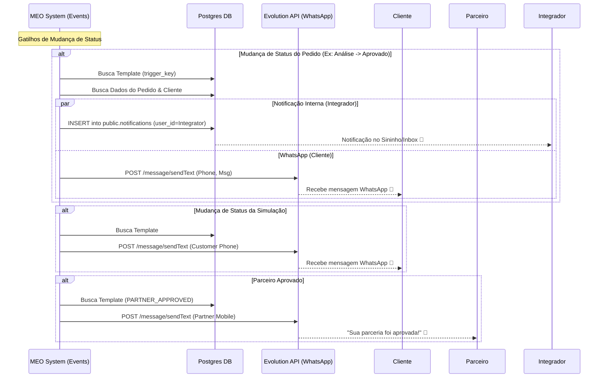

# Automação e Notificações (Transparência)

Este documento detalha o fluxo de automação e notificações do MEO ERP, garantindo transparência para Clientes, Integradores e MEO Energia.

## Visão Geral

O sistema utiliza uma abordagem híbrida para notificações:
1.  **WhatsApp (Evolution API)**: Para comunicação externa imediata com Clientes e Parceiros.
2.  **Notificações Internas (In-App)**: Para avisar Integradores sobre atualizações em seus pedidos dentro da plataforma.

## Diagrama de Fluxo

## Detalhes da Implementação

### 1. Gatilhos (Triggers)
Os eventos são disparados automaticamente pelo backend quando há alteração de status:

*   **Pedidos (`order-events.ts`)**:
    *   Mapeia status do banco (ex: `analysis_pending`, `approved`) para chaves de template (ex: `ORDER_ANALYSIS_PENDING`).
    *   Envia WhatsApp para o Cliente.
    *   Cria notificação interna para o Integrador responsável (`created_by_user_id`).
*   **Simulações (`simulation-events.ts`)**:
    *   Mapeia status (ex: `won`, `lost`) para templates.
    *   Envia WhatsApp para o Cliente.
*   **Parceiros (`partner-events.ts`)**:
    *   Gatilho único: `PARTNER_APPROVED`.
    *   Envia WhatsApp para o Parceiro.

### 2. Serviço de Mensagens
*   **Provider**: Evolution API (Self-hosted ou SaaS).
*   **Credenciais**: Gerenciadas via variáveis de ambiente (`EVOLUTION_API_URL`, `apikey`).
*   **Sanitização**: O sistema formata automaticamente números para o padrão 55 + DDD + 9 dígitos.

### 3. Templates Dinâmicos
Todas as mensagens são configuráveis via banco de dados (`notification_templates`), suportando variáveis dinâmicas:
*   `{{name}}`: Nome do Cliente/Parceiro.
*   `{{order_id}}`: ID curto do pedido.
*   `{{total_value}}`: Valor da simulação.
