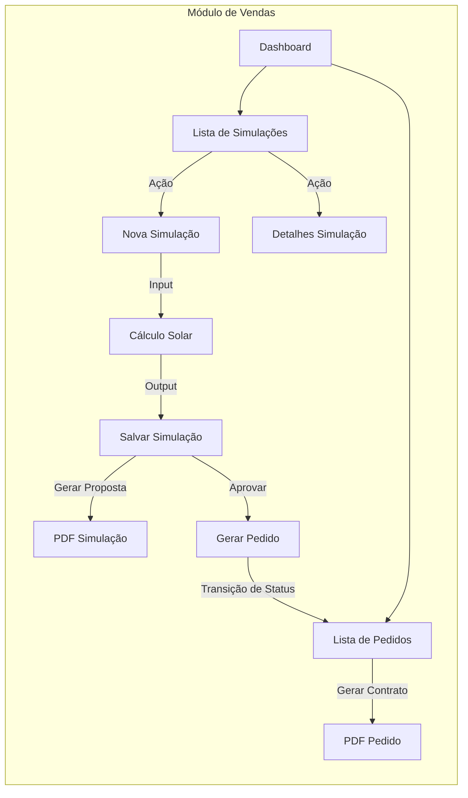
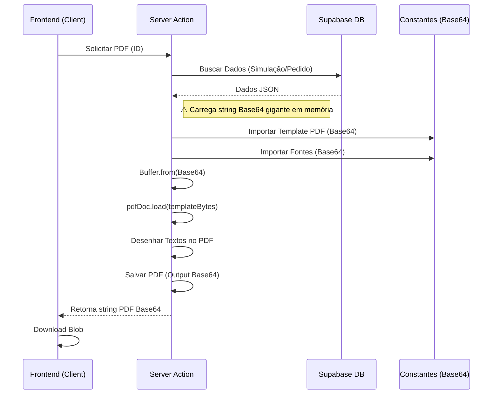
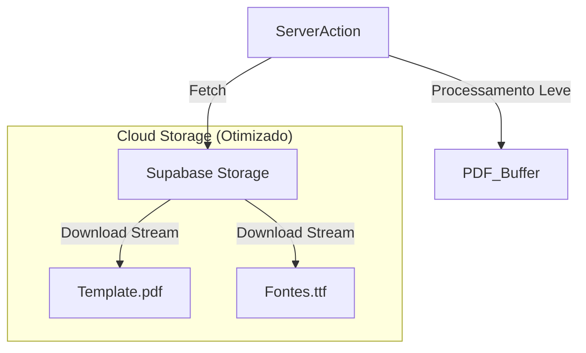

# Fluxo Funcional (Simulações/Pedidos) e Arquitetura de PDF

Este documento descreve o fluxo de trabalho do usuário nos módulos de Simulação e Pedidos, além de detalhar a arquitetura atual de geração de PDFs, identificando pontos de otimização.

## 1. Mapa de Navegação e Funcionalidades

O sistema segue um fluxo linear onde uma **Simulação** aprovada evolui para um **Pedido**.

## 2. Arquitetura de Geração de PDF (Atual vs Refatoração)

Atualmente, a geração de PDF ocorre no servidor (Server Action) utilizando `pdf-lib` e templates/fontes "chumbados" no código em formato Base64.

### Fluxo Atual (Com Gargalo de Performance)

O uso de strings Base64 gigantes (Template + Fontes) diretamente no código aumenta o consumo de memória e o tamanho do bundle.

### Problemas Identificados (Escopo Fase A)

1.  **Hardcoded Assets**: O template do PDF e as fontes estão dentro do código-fonte (`src/lib/constants`), inflando o tamanho da aplicação.
2.  **Uso de Memória**: Converter grandes strings Base64 para Buffer a cada requisição é custoso para o servidor.
3.  **Manutenção**: Alterar o template exige recompilar e redeployar a aplicação.

### Otimização Prevista (Storage)

A refatoração (Prioridade 3) visa mover esses assets para o **Supabase Storage**.

