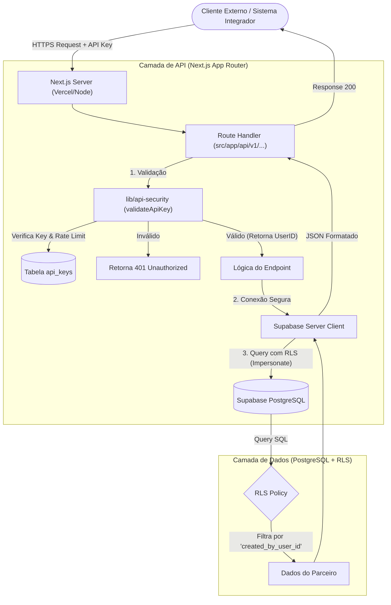

# Arquitetura de Integração via API

Este documento detalha a arquitetura da API REST desenvolvida para integrações externas (Prioridade 4), conforme padronizado no arquivo `src/app/api/v1/...`.

## 1. Visão Geral da Arquitetura

A API foi projetada para ser consumida por parceiros e sistemas externos (webhook, CRM), garantindo segurança e isolamento de dados desde a entrada.



## 2. Detalhes de Implementação

### Autenticação (API Key)
Não utilizamos Cookies ou Sessão para a API Externa. A autenticação é via **Header**:
*   `x-api-key`: Chave única gerada para o parceiro.
*   `Authorization`: Suporte alternativo (Bearer).

A função `validateApiKey`:
1.  Recebe a chave.
2.  Consulta a tabela `api_keys` (cacheada se possível).
3.  Retorna o `userId` dono da chave para aplicar os filtros de segurança.

### Segurança em Profundidade (RLS + Filtro Manual)
Embora o **Row Level Security (RLS)** no banco de dados já impeça o acesso a dados de outros parceiros, a API aplica uma camada extra de segurança no código (Defesa em Profundidade):

```typescript
// Exemplo em src/app/api/v1/orders/route.ts
.eq("created_by_user_id", validation.userId) // Filtro explícito no código
```

Isso garante que, mesmo em caso de falha na configuração da policy do banco, o código do servidor não solicitará dados indevidos.

## 3. Padrão de Resposta (JSON:API style)

Todas as respostas seguem um formato estrito para facilitar o consumo por máquinas.

| Tipo | Estrutura |
| :--- | :--- |
| **Sucesso** | `{ "data": [...], "meta": { "page": 1, "total": 100 } }` |
| **Erro** | `{ "error": { "code": "UNAUTHORIZED", "message": "Descrição..." } }` |

## 4. Endpoints Disponíveis (Fase Atual)

*   `GET /api/v1/orders` - Listagem de Pedidos com paginação.
*   `GET /api/v1/simulations` - Listagem de Simulações.
*   *(Endpoints de escrita como POST/PUT são planejados para fases futuras ou via Webhooks específicos)*
