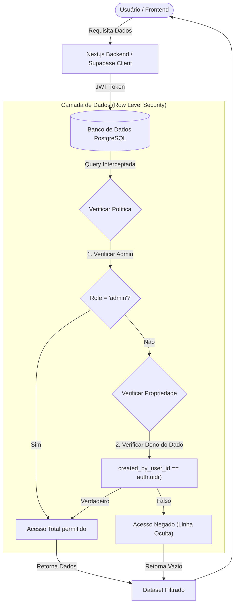

# Arquitetura de Segurança e Multi-tenancy (RLS)

Este documento descreve a implementação da segurança de dados e isolamento entre inquilinos (Multi-tenancy) utilizando **Row Level Security (RLS)** no Supabase.

## Objetivo
Garantir que os dados de cada parceiro (Tenant) sejam acessíveis exclusivamente pelo próprio parceiro ou por administradores do sistema, blindando a aplicação diretamente na camada de banco de dados.

## Implementação

A segurança é aplicada através de Policies do PostgreSQL que interceptam todas as consultas ao banco de dados.

### Fluxo de Verificação

## Regras de Acesso (Policies Atuais)

As regras abaixo refletem o que está implementado nas migrações de segurança (`20260102110437_secure_rls.sql`).

| Tabela | Ator | Condição de Acesso | Tipo de Permissão |
| :--- | :--- | :--- | :--- |
| **Orders** (Pedidos) | **Admin** | `users.role = 'admin'` | Visualizar Tudo |
| | **Parceiro** | `created_by_user_id = auth.uid()` | Visualizar Próprios |
| **Simulations** (Simulações) | **Admin** | `users.role = 'admin'` | Visualizar Tudo |
| | **Parceiro** | `created_by_user_id = auth.uid()` | Visualizar Próprios |
| **Customers** (Clientes) | **Admin** | `users.role = 'admin'` | Visualizar Tudo |
| | **Parceiro** | `created_by_user_id = auth.uid()` | Visualizar Próprios |
| **Partners** (Perfil) | **Admin** | `users.role = 'admin'` | Visualizar Tudo |
| | **Parceiro** | `user_id = auth.uid()` | Visualizar Próprio |

## Permissões (RBAC) vs RLS

Além do RLS (que filtra **quais dados** você vê), o sistema utiliza um modelo RBAC para determinar **quais ações** você pode executar.

*   **Definição**: `src/lib/constants/permissions.ts`
*   **Armazenamento**: Tabela `role_permissions` e `user_permissions`.
*   **Verificação**: Função `public.has_permission('permission:id')`.

Algumas policies específicas (como em `user_profiles`) utilizam `has_permission` para granularidade fina, mas a proteção core de isolamento de dados baseia-se na verificação de ownership descrita acima.
